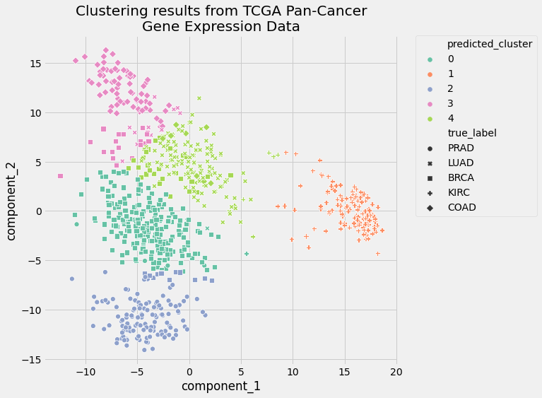
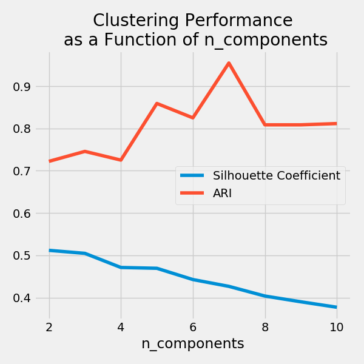

# Clustering 

## What is it and why it matters

The k-means clustering method is an unsupervised machine learning technique used to identify clusters of data objects in a dataset. There are many different types of clustering methods, but k-means is one of the oldest and most approachable. These traits make implementing k-means clustering in Python reasonably straightforward, even for novice programmers and data scientists.

Meaningful clusters expand domain knowledge. For example, in the medical field, researchers applied clustering to gene expression experiments. The clustering results identified groups of patients who respond differently to medical treatments.

Useful clusters, on the other hand, serve as an intermediate step in a data pipeline. For example, businesses use clustering for customer segmentation. The clustering results segment customers into groups with similar purchase histories, which businesses can then use to create targeted advertising campaigns.

There are many other applications of clustering, such as document clustering and social network analysis. These applications are relevant in nearly every industry, making clustering a valuable skill for professionals working with data in any field.

## Clustering techniques
Selecting an appropriate clustering algorithm for your dataset is often difficult due to the number of choices available. Some important factors that affect this decision include the characteristics of the clusters, the features of the dataset, the number of outliers, and the number of data objects.

Popular clustering algorithms:
- Partitional clustering
  
  Divides data objects into nonoverlapping groups. In other words, no object can be a member of more than one cluster, and every cluster must have at least one object.
  
  These techniques require the user to specify the number of clusters, indicated by the variable k. Many partitional clustering algorithms work through an iterative process to assign subsets of data points into k clusters. Two examples of partitional clustering algorithms are k-means and k-medoids.

  These algorithms are both nondeterministic, meaning they could produce different results from two separate runs even if the runs were based on the same input.

  They work well when clusters have a spherical shape.
  They’re scalable with respect to algorithm complexity.
  
  The main element of the algorithm works by a two-step process called expectation-maximization. The expectation step assigns each data point to its nearest centroid. Then, the maximization step computes the mean of all the points for each cluster and sets the new centroid. 

- Hierarchical clustering
  
  Determines cluster assignments by building a hierarchy. This is implemented by either a bottom-up or a top-down approach:

  - Agglomerative clustering is the bottom-up approach. It merges the two points that are the most similar until all points have been merged into a single cluster.

  - Divisive clustering is the top-down approach. It starts with all points as one cluster and splits the least similar clusters at each step until only single data points remain.

  These methods produce a tree-based hierarchy of points called a dendrogram. Similar to partitional clustering, in hierarchical clustering the number of clusters (k) is often predetermined by the user. Clusters are assigned by cutting the dendrogram at a specified depth that results in k groups of smaller dendrograms.

  Unlike many partitional clustering techniques, hierarchical clustering is a deterministic process, meaning cluster assignments won’t change when you run an algorithm twice on the same input data.
  
  The strengths of hierarchical clustering methods include the following:

  - They often reveal the finer details about the relationships between data objects.
  - They provide an interpretable dendrogram.

  The weaknesses of hierarchical clustering methods include the following:

  - They’re computationally expensive with respect to algorithm complexity.
  - They’re sensitive to noise and outliers.

- Density-based clustering
  Determines cluster assignments based on the density of data points in a region. Clusters are assigned where there are high densities of data points separated by low-density regions.

  Unlike the other clustering categories, this approach doesn’t require the user to specify the number of clusters. Instead, there is a distance-based parameter that acts as a tunable threshold. This threshold determines how close points must be to be considered a cluster member.

  Examples of density-based clustering algorithms include Density-Based Spatial Clustering of Applications with Noise, or DBSCAN, and Ordering Points To Identify the Clustering Structure, or OPTICS.

  The strengths of density-based clustering methods include the following:

  - They excel at identifying clusters of nonspherical shapes.
  - They’re resistant to outliers.

  The weaknesses of density-based clustering methods include the following:

  - They aren’t well suited for clustering in high-dimensional spaces.
  - They have trouble identifying clusters of varying densities.

## K-means and density based clustering

## Evaluation of clustering performances with silhouette metrics
Two methods that are commonly used to evaluate the appropriate number of clusters:

- The elbow method
  There’s a sweet spot where the SSE curve starts to bend known as the elbow point. The x-value of this point is thought to be a reasonable trade-off between error and number of clusters. 
  
- The silhouette coefficient
  This is a measure of cluster cohesion and separation. It quantifies how well a data point fits into its assigned cluster based on two factors:

  - How close the data point is to other points in the cluster
  - How far away the data point is from points in other clusters

The elbow method and silhouette coefficient evaluate clustering performance without the use of ground truth labels. 

These are often used as complementary evaluation techniques rather than one being preferred over the other. To perform the elbow method, run several k-means, increment k with each iteration, and record the SSE

**Adjusted rand index (ARI)**

Unlike the silhouette coefficient, the ARI uses true cluster assignments to measure the similarity between true and predicted labels.

## Pipeline building

### Dataset

Data contain gene expression values from a manuscript authored by The Cancer Genome Atlas (TCGA) Pan-Cancer analysis project investigators.

There are 881 samples (rows) representing five distinct cancer subtypes. Each sample has gene expression values for 20,531 genes (columns). The dataset is available from the UC Irvine Machine Learning Repository, but you can use the Python code below to obtain the data programmatically.

### Preprocessing
An equally important data transformation technique is dimensionality reduction, which reduces the number of features in the dataset by either removing or combining them.

Principal Component Analysis (PCA) is one of many dimensionality reduction techniques. PCA transforms the input data by projecting it into a lower number of dimensions called components. The components capture the variability of the input data through a linear combination of the input data’s features.

The pipeline implements an alternative to the StandardScaler class called MinMaxScaler for feature scaling. You use MinMaxScaler when you do not assume that the shape of all your features follows a normal distribution.

The next step in the preprocessing pipeline will implement the PCA class to perform dimensionality reduction

## Plotting

Plot the evaluation metrics as a function of n_components to visualize the relationship between adding components and the performance of the k-means clustering results

References:
- https://realpython.com/k-means-clustering-python/

